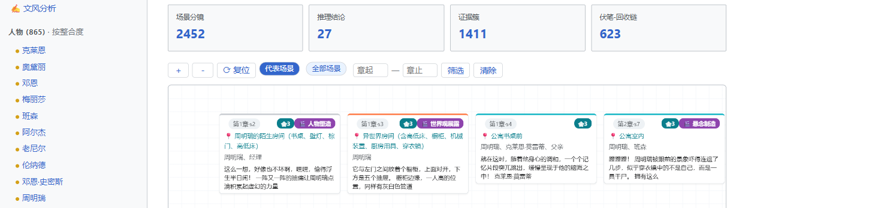

# NovelPedia · 小说拆书引擎

> 把一本小说拆成**可验证的结构化数据**：场景 → 实体 → 设定 → 人物 → 文风，最终渲染成一张双击即开的交互式知识库。
> Local-first pipeline that turns a novel into auditable structured data — scenes, entities, worldbuilding, character arcs and style analysis — rendered as a single self-contained, interactive HTML workspace.

## ✨ 三大亮点

### ① 拆解过程白盒化

不是黑盒摘要器。每一层都是显式中间产物，每一步可查、可停、可重跑：

| 环节 | 产物 | 怎么验证 |
|---|---|---|
| 场景抽取 | SQLite 场景库（who / where / actinfo 七通道） | 每条记录带章节 + 场景锚点，可直接 SQL 复查 |
| 实体归一化 | `entity_registry` 别名注册表 | 别名图**双向互指**归并（克莱恩=周明瑞 分得清），回归测试锁定行为 |
| 三维挖掘 | 设定 / 人物 / 文风 JSON | 每条结论带「统计聚合 / LLM 推断」来源标签，可回溯到原文 |
| 运行全程 | `module_manifest.json` + logbook + token 账本 | 每个模块 ok / skip / fail 留痕，token 按模型分组逐次落盘 |

### ② 不依赖强模型 —— 本地 8B 跑通全流程

- 抽取 / 收集 / 挖掘 / 可视化全链路在本地 Ollama **qwen3:8b** 实测跑通：10 章样本 **75 秒（7.5 秒/章）、10.5k tokens**，必现实体命中 **6/9**——与云端 dots3-note（155 秒、6/9）同题对比，逐项数据见 [compare_10ch/compare_result.md](compare_10ch/compare_result.md)
- 为小模型设计的容错：JSON 解析失败自动重试、失败模块隔离不阻塞全流程、断点缓存续跑
- 云端强模型是**可选项**（保质量、保别名归一），不是门槛

### ③ 产物直观 —— 双击即开、可交互

- 拆完得到**一个自包含 `index.html`**：零外部依赖、无需起服务，双击浏览器打开
- 人物 / 设定 / 剧情推理 / 文风四大板块：出场分布图、关系图谱（拖拽 / 缩放 / 筛选）、场景拉片画布（平移 / 缩放 / 章节筛选）、文风四维测量（词 · 句 · 段 · 篇）
- 同步落盘 `detail_data / graph_data / personality` JSON——可视化只是壳，数据随时可被下游工具直接消费

## 🧰 技术特点

| | 说明 |
|---|---|
| **多模型支持** | `models.json` 注册表内置 **16 预设 / 4 种协议**（Ollama 本地 / OpenAI 兼容 / Anthropic 原生 / Google 原生）；新增厂商 = 加一组字段 |
| **角色级路由** | 抽取用便宜模型、挖掘用中档、评述用旗舰：`--role mine=deepseek-v3-2 review=claude-sonnet-4-6` 一行配平成本与质量 |
| **可插拔** | stage1 / stage2 每个模块独立重跑：`--only registry\|setting\|character\|style` + skip-if-exists 幂等跳过 |
| **可覆写** | 产物原子写（先 `.tmp` 再 `os.replace`，杜绝半截文件）；`--force` 强制覆盖；固定 `run.date_suffix` 可让设定图谱跨次累积 |
| **连续执行不崩** | 断点缓存（extract 有缓存秒过）、失败模块隔离、logbook 双通道日志 + `cli analyze` 健康度报告（H1-H5）、回归测试锁定核心行为 |
| **本地性能好** | 管线仅 Python 标准库（sqlite3 / urllib / re / concurrent.futures），**零第三方依赖**（jieba 可选）；1308 章全量实测 extract 168min / collect 170s / mine 23s |
| **防幻觉** | 设定词条全局锚定、公版体系图 RAG 触发式加载、证据链可溯源原文；云端深度思考强制关闭（防 reasoning token 虚高 6 倍） |
| **token 计量** | 每次调用原子落盘 `logs/token_total.json`（by_model 分组），跑批成本可核算 |

## ⚡ 快速开始（30 秒版）

```bash
# 0) 本地模式准备（零成本）：Python ≥ 3.10 + Ollama
ollama pull qwen3:8b

# 1) 小说 txt 放到 resource/小说.txt（不入库）
# 2) 四条命令跑全流程
python src/cli.py extract --backend qwen3-8b
python src/cli.py collect --backend qwen3-8b
python src/cli.py mine    --backend qwen3-8b
python src/cli.py viz     --backend qwen3-8b
# 3) 双击打开 output/pedia_<书名>_<日期>/index.html
```

也可以 `python src/cli.py` 进入交互菜单（选后端 + 选任务）；Windows 可直接双击 `run.bat`。

**云端模型、16 预设模型表、角色路由、CLI 全表、参数调优、失败重跑、数据契约、FAQ → [docs/快速开始.md](docs/快速开始.md)**

## 🖥️ 成品 Demo

《诡秘之主》前 300 章实测：1,075,973 字 → **865 人物 / 81 设定 / 101 设定关系 / 6,134 暗线证据 / 2,452 场景分镜 / 623 伏笔-回收链**。


| 人物档案（克莱恩） | 文风四维（词 · 句 · 段 · 篇） |
|---|---|
|  |  |



**单文件成品：[`demo/index.html`](demo/index.html)（约 7MB，双击即开）**

> ⚠️ **版权声明**：demo 数据来自公开连载作品《诡秘之主》的**评论性可视化**（图谱 / 统计 / 短引用），仅用于展示引擎能力。小说原文**不会**出现在仓库中，`resource/` 下的用户文本一律不入库（见 .gitignore）。请仅对你有权处理的作品运行本管线。

## 📚 文档索引

| 文档 | 内容 |
|---|---|
| [docs/快速开始.md](docs/快速开始.md) | ★ 从零跑通：环境 / 云端 / 模型矩阵 / CLI 全表 / 数据契约 / 已知取舍 |
| [docs/使用说明.md](docs/使用说明.md) | 日常操作手册 + FAQ |
| [docs/技术文档.md](docs/技术文档.md) | 架构 / schema / 性能 / 踩坑 |
| [docs/参数配置与运行效率.md](docs/参数配置与运行效率.md) | 全字段配置表 + 实测耗时 |
| [docs/配置总览.md](docs/配置总览.md) | config_schema 自动生成清单（防文档漂移） |
| [docs/日志与跑批分析.md](docs/日志与跑批分析.md) | logbook 与健康度报告 |
| [docs/doubt_index_design.md](docs/doubt_index_design.md) | 质疑指数（挖掘深度）设计 |

> **pedia / studio 分工**：`pedia`（本仓库，MIT 开源）= 故事提取 + RAG + 实体归一化，输出 wiki 与数据源；深度人格 / 剧情推理在闭源 `studio`，不进开源仓。

## ⚖️ 版权与合规

- `resource/` 下的小说原文**不入库**（.gitignore 硬性排除），请仅处理你有权使用的作品
- demo 为公开作品的评论性可视化（短引用 + 统计），用途为技术展示
- 模型 key 严禁写入任何入库文件（`.env` / `*.key` / `*api_key*` 全在 gitignore 红线）

## 📄 License

MIT — 详见 [LICENSE](LICENSE)。
