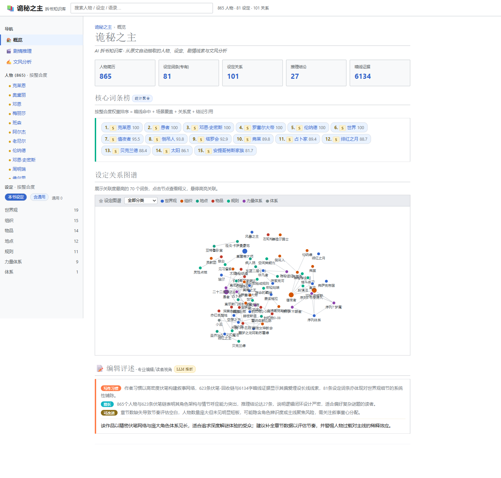
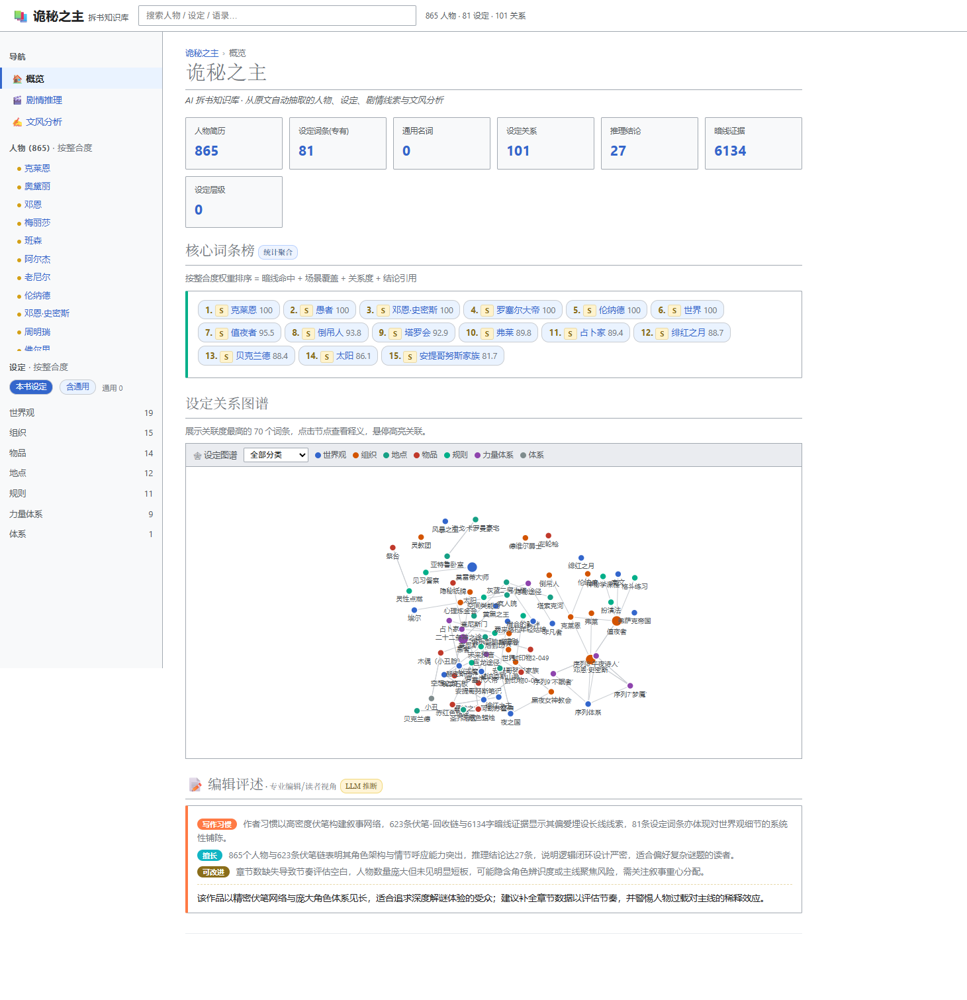
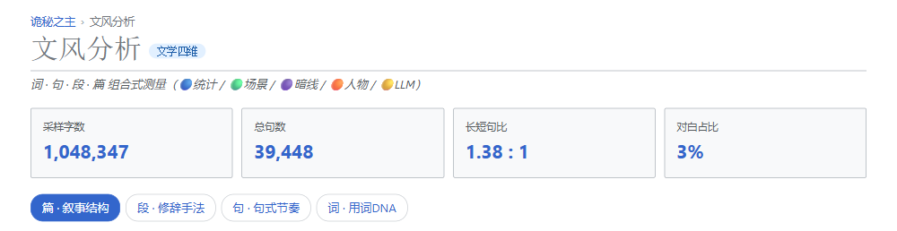

# StoryScienceLab · pedia（小说拆书工程·开源版）

> **把一本小说拆成可验证的结构化数据**：场景抽取 → 实体归一化 → 多智能体挖掘（设定/人物/文风）→ 自包含可视化工作台。
> Local-first pipeline that turns a novel into auditable structured data — scenes, entities
> (alias normalization), worldbuilding, character arcs and style analysis — rendered into a
> single self-contained HTML workspace.

---

## ✨ 特性

- **多类型模型匹配**：`models.json` 预设注册表（本地 Ollama / 智谱 GLM / dots.ai / DeepSeek / Kimi / 通义…），OpenAI 兼容端点任加
- **角色级模型路由**：抽取、挖掘、评述等阶段可分别指定不同模型（便宜模型跑高频，强模型做评述）
- **单文件成品**：整本书的拆书结果是一个自包含 `index.html`（零外部依赖，双击即开）
- **三维拆解**：设定图谱 / 人物简历 / 文风分析（篇→段→句→词）+ 最简章纲（深度推理已整体迁至闭源 studio）
- **实体归一化**：`entity_registry` 每章抽稳定实体+别名，别名图确定性归并（克莱恩 = 周明瑞 可分得清）
- **编辑评述 agent**：每个板块给出专业编辑视角的 habits / strengths / weaknesses / summary
- **可插拔模块 + 失败重跑覆盖**：stage1/stage2 每个模块支持 `--only <module>` 单模块重跑 + `--force` 覆盖 + skip-if-exists 幂等跳过（配 `module_manifest.json` 核查每个模块 ok/skip/fail）
- **持久 token 计量**：`llm_client` 每次调用原子落盘 `logs/token_total.json`（by_model 分组，支撑全量跑批真实成本核算）
- **防幻觉**：设定词条全局锚定、公版体系图 RAG 触发式加载、证据链可溯源到原文
- **零重依赖**：管线仅用 Python 标准库（sqlite3 / urllib / re / concurrent.futures），jieba 可选
- **跑批日志**：logbook 结构化双通道日志 + `cli analyze` 健康度报告（H1-H5）

> **pedia / studio 分工**：`pedia`（本仓库，MIT 开源）= 故事提取 + RAG + 实体归一化，输出可编辑 wiki HTML 及数据源；
> `studio`（闭源）= 人物深度"揉碎"分析（含原 pedia 的暗线/剧情推理/拉片标注）。深度推理不进开源仓。

## 🖥️ 成品 Demo（唯一演示）

用《诡秘之主》前 300 章跑出的完整拆书工作台（人物/设定/文风 + 编辑评述）：

| | |
|---|---|
| **单文件** | [`demo/index.html`](demo/index.html) — 6.8MB 自包含，浏览器直接打开 |
| 概览 |  |
| 人物 |  |
| 文风 |  |

> ⚠️ **版权声明**：demo 数据来自公开连载小说《诡秘之主》的**评论性可视化**（关系图谱/数据统计/短引用），
> 仅用于展示引擎能力。小说原文 **不会** 出现在仓库中，`resource/` 下的用户文本一律不入库（见 .gitignore）。
> 请仅对你有权处理的作品运行本管线。

---

## 🚀 快速开始（改配置 → 放小说 → 跑 → 看产物）

```bash
# 1. 把你的小说放好（txt 或 epub 转 txt）
#    resource/小说.txt   ← 默认路径（.gitignore 已排除，不会入库）
#    或改 settings.json 的 novel.path / novel.name / novel.chapters

# 2. 选后端跑全流程（本地 Ollama 零成本，需先装 Ollama + qwen3:8b）
python src/cli.py extract  --backend qwen3-8b
python src/cli.py collect  --backend qwen3-8b
python src/cli.py mine     --backend qwen3-8b
python src/cli.py viz      --backend qwen3-8b   # 生成 outputs/<书名>_<时间>/index.html

# 云端（效果更强，需 API key）
set LLM_API_KEY=你的key
python src/cli.py extract --backend dots3-note
python src/cli.py collect --backend dots3-note
python src/cli.py mine    --backend dots3-note
python src/cli.py viz     --backend dots3-note
```

也可以 `python src/cli.py` 进入交互菜单（选后端 + 选任务）。

### 失败重跑覆盖（可插拔模块）

```bash
# 只重跑单个模块（产物已存在且合法则自动跳过；--force 强制覆盖）
python src/cli.py collect --backend dots3-note --only registry   # 仅实体注册表
python src/cli.py collect --backend dots3-note --only setting    # 仅设定图谱
python src/cli.py mine    --backend dots3-note --only character  # 仅人物简历
python src/cli.py mine    --backend dots3-note --only style --force  # 强制覆盖文风
# 每次运行末尾写 module_manifest.json：{modules: {registry: ok, setting: skip, ...}}
```

## 🧠 多类型模型匹配（models.json）

所有模型集中在一个注册表 [`models.json`](models.json)，`cli.py --backend <预设名>` 选择主模型：

```bash
python src/cli.py --list-backends    # 查看全部预设与能力字段（🆓免费 / 💰付费标注）
```

内置 **16 个预设 / 4 种后端协议**（数据来源：2026 年 8 月各厂商最新文档）：

| 预设名 | 厂商 / 后端协议 | 模型（2026 最新） | 上下文 | 成本 |
|---|---|---|---|---|
| `dots3-note` | 小红书 dots.ai（openai） | dots3-note-prev | 512K | 💰 |
| `gpt-5` | OpenAI（openai） | **gpt-5** | 400K | 💰 |
| `gpt-5-mini` | OpenAI 性价比（openai） | **gpt-5-mini** | 400K | 💰 |
| `claude-opus-4-8` | Anthropic 旗舰（**anthropic 原生**） | **claude-opus-4-8** | **1M** | 💰 |
| `claude-sonnet-4-6` | Anthropic 主力（**anthropic 原生**） | **claude-sonnet-4-6** | **1M** | 💰 |
| `claude-haiku-4-5` | Anthropic 便宜快（**anthropic 原生**） | claude-haiku-4-5 | 200K | 💰 |
| `gemini-3-flash` | Google 免费（**google 原生**） | **gemini-3-flash-preview** | **1M** | 🆓 |
| `gemini-3-pro` | Google 旗舰（**google 原生**） | **gemini-3-pro-preview** | **2M** | 💰 |
| `deepseek-v3-2` | DeepSeek V3.2 稀疏注意力（openai） | **deepseek-v3.2** | 128K | 💰 |
| `deepseek-r1` | DeepSeek R1 推理（openai） | deepseek-r1-0528 | 128K | 💰 |
| `kimi-k2-5` | Moonshot K2.5（openai） | **kimi-k2.5** | 262K | 💰 |
| `qwen3-max` | 阿里通义 Qwen3-Max（openai） | **qwen3-max** | 262K | 💰 |
| `glm-4.7-flash` | 智谱 GLM-4.7-Flash（openai） | glm-4.7-flash | 200K | 🆓 |
| `glm-5-2` | 智谱 GLM-5.2 **1M MIT 开源**（openai） | **glm-5.2** | **1M** | 💰 |
| `groq-llama` | Groq 高速（openai） | llama-3.3-70b-versatile | 128K | 🆓 |
| `qwen3-8b` | 本地 Ollama（ollama） | qwen3:8b | 32K | 🆓🏠 |

- **四种后端协议**：`ollama`（本地）/ `openai`（OpenAI 兼容，绝大多数厂商）/ `anthropic`（Claude 原生 /v1/messages）/ `google`（Gemini 原生 generateContent）——`llm_client.py` 已内置适配，**新增厂商只需往 `presets` 加一组**
- **key 不落盘**：从环境变量 `LLM_API_KEY` 或 `--key` 传入；dots.ai 可用独立 `DOTSAI_API_KEY` 避免与主 key 互扰；`.env` 已被 gitignore 硬性排除
- **模型 ID 以厂商最新文档为准**——本表是 2026-08 查证值，厂商发新版后改 `model` 字段即可

### 角色路由（--role）

管线按角色分阶段，每个角色可以指定不同模型：

| 角色 | 阶段 | 建议 |
|---|---|---|
| `extract` | 场景抽取（高频短输出） | 便宜/快 |
| `collect` | 三维收集（高频） | 便宜/快 |
| `mine` | 设定强化/人物简历/文风分析（中频长输出） | 强模型 |
| `review` | 编辑评述/创作解析（低频高质量） | 最强模型 |
| `summary` | 章纲/总结 | 中 |
| `embed` | 向量化（仅 ollama） | bge-m3 |

```bash
# 主模型用本地 qwen3，评述/创作解析用 Claude Sonnet 4.6，挖掘用 DeepSeek V3.2
python src/cli.py collect --backend qwen3-8b
python src/cli.py mine    --backend qwen3-8b --role mine=deepseek-v3-2
python src/cli.py review  --backend qwen3-8b --role review=claude-sonnet-4-6
```

> **运行时清晰提示**：每条命令启动都会打印当前后端摘要
> `▶ 后端 [xxx] 名称 🆓/💰 | model / 上下文 / 并发 / JSON模式`；
> 每个子任务结束打印耗时 `⏱ ... 耗时 Xs`；
> LLM 请求失败会给出中文定位提示（`401`=key 无效、`403`=无权限、`404`=模型名/端点错、`429`=限流请降并发）。

## 📖 命令行总览（`src/cli.py` 统一入口）

```
python src/cli.py <任务> [--backend 预设名] [--chapters N] [--model M] [--key K]
                     [--role role=预设] [--genre 类别] [--parallel N]
                     [--only 模块名] [--force]
```

| 任务 | 做什么 | 产物 |
|---|---|---|
| `extract` | 分场景抽取（TXT→SQLite，有缓存可秒过） | `data/stage1_v2_<N>_<书>.db` |
| `collect` | Stage1 三维收集（实体注册表/设定/人物/文风采样） | `outputs/<书>_<日期>/stage1/*.json` |
| `mine` | Stage2 三维挖掘（设定强化/人物简历/文风分析） | `outputs/<书>_<日期>/stage2/*.json` |
| `review` | 全板块编辑评述（专业编辑视角） | `editor_reviews.json` |
| `build` | Stage2 直出（章纲/人物/设定/总结） | `outputs/<书>_<日期>/stage2/` |
| `personality` | 人物性格六维向量（雷达图） | `personality.json` |
| `graph` | 知识图谱数据（角色+设定，章节筛选） | `knowledge_graph` JSON 数据 |
| `detail` | 拆书详情数据（人物/设定/文风三 Tab 数据供给） | `detail_data.json` |
| `report` | 本地 vs 云端对比报告 | `final_report.html` |
| `rag "问题"` | RAG 问答 | 控制台答案 |
| `viz` | **一键**：详情页+图谱+报告 → 单页工作台 | `outputs/<书>_<日期>/index.html` |
| `analyze` | 跑批日志健康度报告 | 控制台 H1-H5 |

其他参数：

- `--genre 类别`（宫斗/修仙/诡秘/系统/灵异/都市…）：**按类别**加载公版体系图作参考（补档/分类/候选），默认不加载，与原文冲突以原文为准
- `--doubt-index 0-1`：质疑指数，控制挖掘的思考深度
- `--parallel N`：collect/mine 的场景级并发数（默认 4，注意模型 concurrency 限制）
- `--src DIR`：可视化任务指定读哪个 stage1 产物目录
- `--only registry|setting|character|style`（collect）/ `setting|character|style`（mine）：单模块重跑
- `--force`：强制覆盖已存在产物（默认 skip-if-exists 幂等跳过）

## 🗂️ 目录结构

```
pedia/
├─ settings.json              # ★ 配置：小说路径/章数/主模型
├─ models.json                # ★ 模型预设注册表 + 角色路由
├─ demo/                      # ★ 唯一成品 demo（index.html + 截图）
├─ resource/                  #   放你的小说 txt（.gitignore 排除，不入库）
├─ run.bat                    #   一键入口（默认跑可视化层）
├─ README.md / docs/          #   使用说明 + 技术文档 + 算法设计 + 日志分析
├─ src/                       # ★ 全部代码（.py + .html 模板）
│  ├─ cli.py                  #   统一入口（任务编排 + 后端切换 + 可视化归档）
│  ├─ llm_client.py           #   统一 LLM 调用层（预设解析 + 角色路由 + 重试 + 持久 token 计量）
│  ├─ config.py / config_schema.py  # 配置中心（单一真源 settings.json）
│  ├─ extract.py / main.py / db.py / segment.py / prompts.py   # Stage1 抽取
│  ├─ stage1_collect.py       #   Stage1 三维收集（实体注册表/设定/人物/文风采样，可插拔）
│  ├─ entity_registry.py      #   全局实体注册表（别名→规范名归一化，克莱恩=周明瑞）
│  ├─ stage2_mine.py          #   Stage2 三维挖掘（设定强化/人物简历/文风分析，可插拔）
│  ├─ setting_agent.py / character_agent.py / style_sampler.py / style_baseline.py
│  ├─ editor_review.py        #   全板块编辑评述
│  ├─ webnovel_lexicon.py / knowledge_router.py / knowledge.py   # 公版体系图 RAG
│  ├─ logbook.py / analyze_log.py            # 跑批日志 + 健康度分析
│  ├─ export_graph.py / build_detail.py / gen_personality.py     # pedia 数据供给
│  └─ index_template.html / panel.py                             # 可视化模板 + 面板
├─ data/                      # 中间产物（.gitignore 排除，可跨次复用）
└─ outputs/                   # 每次运行的产物目录（.gitignore 排除）
```

## 🔧 底层管线（技术速览）

```
小说.txt ─► 分场景抽取 actinfo v2 ─► SQLite
                  │
                  ▼
      Stage1 三维收集(实体注册表/设定/人物/文风采样) ─► JSON
                  │
                  ▼
      Stage2 三维挖掘(设定强化/人物简历/文风分析) ─► JSON
                  │
                  ▼
      review ─► 编辑评述
                  │
                  ▼
      viz: 单文件自包含 index.html（零外部依赖）
```

- **实体归一化先行**：Stage1 Pass0 用 `entity_registry` 每章一次 LLM 抽稳定实体+别名，下游 alias 图 union-find 归并——「克莱恩/周明瑞/愚者」同一实体的核心能力
- **明线轻量抽取**：Stage1 逐场景轻量抽取（0 推理，token 硬上限）；深度推理（暗线/剧情推理/拉片标注）已迁闭源 studio
- **质疑指数** `doubt_index`：控制挖掘的思考深度（见 [docs/doubt_index_design.md](docs/doubt_index_design.md)）
- **⚠️ 云端深度思考必须关**：dots.ai/GLM 默认开 thinking 时只返回 `reasoning_content`（token 虚高 6 倍）。`llm_client.py` 已内置双保险关闭（`thinking.disabled` + `chat_template_kwargs.enable_thinking:false`）
- **输入省 42% token**：抽取层产出 actinfo JSON 流比 TXT 原文直出更省
- **可插拔 + 重跑覆盖**：每个模块原子写（先 .tmp 再 os.replace 防半截文件）+ `module_manifest.json` 记录 ok/skip/fail，失败单模块重跑不影响其他产物
- **持久 token 计量**：`logs/token_total.json` 累加 prompt/completion（by_model 分组），崩溃安全

详见 [docs/技术文档.md](docs/技术文档.md)（架构/schema/性能/踩坑）与 [docs/使用说明.md](docs/使用说明.md)（操作/FAQ）。

## ⚙️ 参数配置与运行效率

**完整速查**：[docs/参数配置与运行效率.md](docs/参数配置与运行效率.md)（settings/models/CLI/环境变量全字段表 + 实测数据）

**统一配置注册表**：全部行为开关收敛于 `src/config_schema.py`（分层来源：**运行时覆盖 > 环境变量 > settings.json > 内置默认**），`python src/cli.py --list-config` 打印全表；完整清单见 [docs/配置总览.md](docs/配置总览.md)（自动生成，防文档漂移）。新增开关 = 一行 `register()`，零改中心代码。常用行为开关：

| 开关 | 配置项 | 说明 |
|---|---|---|
| 省本地 CPU | `EMBED_OFF=1` 或 `embed.off` | 跳过 bge-m3 向量索引/设定向量化（FTS 检索不受影响） |
| 全量重抽设定 | `--fresh` 或 `collect.fresh` | 删除旧 settings_graph 增量，设定全量重抽（全书重跑必须加） |
| 联网搜索 | `EXTERNAL_SEARCH=1` 或 `rag.external_search` | 启用 knowledge_router L3 联网钩子（需自行实现搜索接口） |
| 类别加载 | `--genre 宫斗` | 按类别加载公版体系域（默认 global 不开放） |

### 运行效率实测（诡秘之主 1308 章全量，2026-08-31 跑批）

| 阶段 | 1308 章全量 | 说明 |
|---|---|---|
| extract 场景抽取 | **167.7 分钟**（10161 场景块） | 每场景 1 次 LLM（dots.ai 并发 1） |
| collect 三维收集 | **169.6 秒** | 复用已抽取库（免重抽场景） |
| mine 三维挖掘 | **22.6 秒** | 簇级批量推理 |
| **合计** | **≈171 分钟** | extract 占 98% |

> 10 章样本双模型实测（2026-09-01，实体抓取 registry）：dots3-note **118 实体 / 155s**；本地 qwen3:8b 数据见 `compare_10ch/compare_result.md`（含 token 消耗与命中率对比）。

### 关键参数速查

```bash
# 快模型跑高频 + 强模型做评述（成本/速度最优组合）
python src/cli.py collect --backend groq-llama          # 🆓 数百 tok/s
python src/cli.py mine    --backend groq-llama --role mine=deepseek-chat
python src/cli.py review  --backend dots3-note --role review=claude-sonnet

# 推理深度 / 并发 / 类别库 / 单模块重跑
--doubt-index 0.5        # 0.3 保守 → 0.7 激进
--parallel 4             # 不要超过预设 concurrency（dots.ai=1, 强模型=2-4）
--genre 诡秘             # 按类别加载公版体系图作参考（默认不加载）
--only registry --force  # 单模块失败重跑覆盖
```

- **增量复用**：`extract` 有缓存秒过；固定 `run.date_suffix` 可让设定图谱跨次累积；只改可视化用 `viz --src <已有stage1目录>` 纯本地渲染
- **全字段表**：settings.json（novel/llm/run.archive）、models.json（18 预设字段）、CLI 参数、环境变量（`LLM_API_KEY`/`DOTSAI_API_KEY`/`LLM_ROLE_MODELS`/`NOVEL_NAME` 等）→ 见上方文档

## ⚙️ 环境准备

```bash
# Python ≥ 3.10（仅标准库即可跑通；jieba 用于词频，可选）
pip install jieba

# 本地模式：Ollama + 模型（零成本/离线）
ollama pull qwen3:8b      # 抽取/挖掘
ollama pull bge-m3        # RAG 向量（可选，未拉则自动降级规则切分 + FTS5）

# 云端模式：只需 API key
set LLM_API_KEY=你的key   # dots.ai / 智谱 / DeepSeek / Kimi 通用
set DOTSAI_API_KEY=你的key  # dots.ai 独立 key（可选，避免与主 key 互扰）
```

## ⚖️ 版权与合规

- `resource/` 下的小说原文**不入库**（.gitignore 硬性排除），请仅处理你有权使用的作品
- demo 为公开作品的评论性可视化（短引用 + 统计），用途为技术展示
- 模型 key 严禁写入任何入库文件（`.env` / `*.key` / `*api_key*` 全在 gitignore 红线）

## 已知取舍

1. 本地小模型偶发吐坏 JSON；换 8b 或云端全成功（10 章实测命中率见 compare_10ch）
2. 云端 dots.ai 限流，全量跑需耐心（1308 章 extract 约 2.8 小时）
3. 排比/修辞为规则近似检测，数值仅作风格参考
4. 人物重名依赖别名图确定性归并，个别同人可能仍拆分
5. 向量相似度阈值 0.62、`doubt_index` 0.5 为《诡秘之主》实测校准，换书可调

## 📄 License

MIT — 详见 [LICENSE](LICENSE)。
